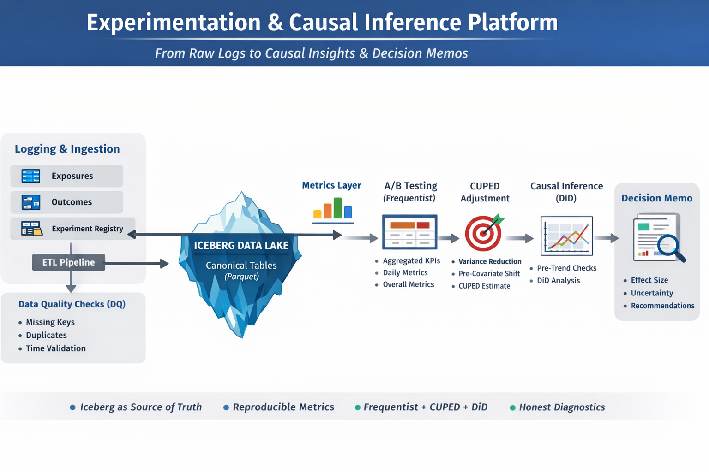
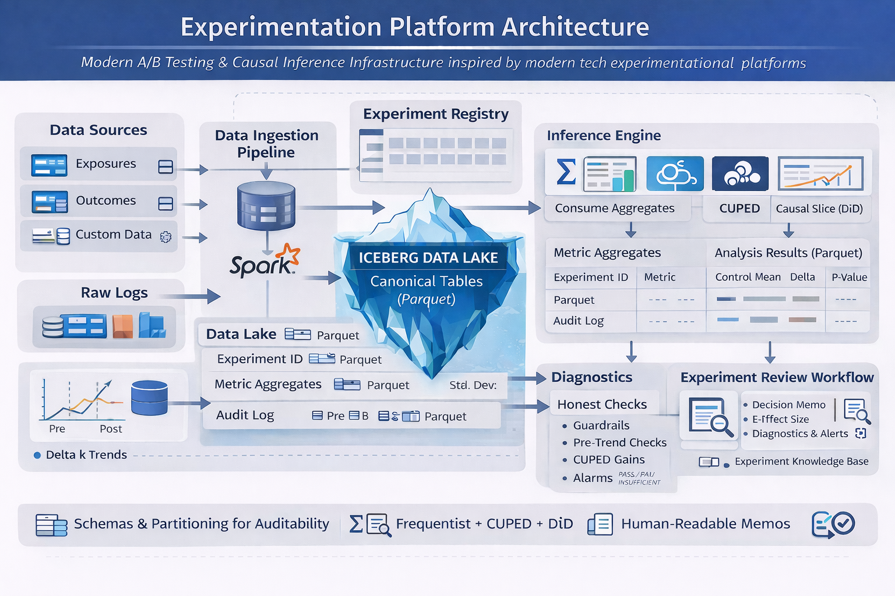

# Experimentation & Causal Inference Platform (Local)

This repository implements a **local-first experimentation platform** supporting:

- Ad-hoc A/B experiments
- Persistent experiment data (Iceberg tables)
- Multiple analyses per experiment (A/B, CUPED, DiD, pre-trends)
- Safe reruns (idempotent writes)
- Synthetic data generation for fast iteration

The platform is designed to run entirely on a **local Spark + Iceberg + MinIO stack**.

## Platform Overview:



---

## 1. Prerequisites

### Required Runtime

- **Python**: 3.9+ (3.10 / 3.11 tested)
- **Java**: 11 (required by Spark)
- **Docker + Docker Compose**
- **Apache Spark** (local or containerized)
- **Apache Iceberg** (Spark catalog)
- **MinIO** (S3-compatible object storage)

### This Project Assumes

- Spark is configured with Iceberg support
- MinIO is reachable via `s3a://`
- Spark session creation is handled by  
  `exp_platform.spark.session.build_spark_session`

### You Do Not Need

- Cloud accounts
- External databases
- Kubernetes

---

## 2. Environment Expectations

### Iceberg Catalog

All structured outputs are written to the Iceberg namespace:

```
iceberg.exp.*
```

Tables are created automatically if missing.

### Core Tables

- `exposures`
- `outcomes`
- `experiment_registry`
- `metric_aggregates_overall`
- `metric_aggregates_daily`
- `analysis_results`
- `did_pretrend_delta`
- `did_pretrend_tests`

---

### Object Storage (MinIO)

Raw synthetic data is written to:

```
s3://raw/exp_platform/<experiment_id>/
```

---

## 3. Quickstart (End-to-End)

### Generate Synthetic Data + Run All Analyses

```bash
python -m exp_platform.pipelines.run_end_to_end \
  --config configs/dev.yaml \
  --experiment-id exp_checkout_button_001 \
  --generate-synth
```

### This Single Command

- Generates synthetic experiment data
- Ingests raw Parquet into Iceberg
- Runs data quality checks
- Computes metric aggregates
- Runs:
  - A/B analysis
  - CUPED
  - Difference-in-Differences
  - Pre-trends test
- Writes a human-readable memo

If this command completes successfully, the platform is working end-to-end.

---

## 4. Verifying Outputs (Optional)

```python
from exp_platform.spark.session import build_spark_session

spark = build_spark_session("smoke_outputs")
for t in [
  "iceberg.exp.exposures",
  "iceberg.exp.outcomes",
  "iceberg.exp.experiment_registry",
  "iceberg.exp.metric_aggregates_overall",
  "iceberg.exp.metric_aggregates_daily",
  "iceberg.exp.analysis_results",
]:
    print(t, spark.table(t).count())
spark.stop()
```

---

## 5. Running Multiple Ad-Hoc Experiments

Each experiment is identified solely by `experiment_id`.

```bash
python -m exp_platform.pipelines.run_end_to_end \
  --config configs/dev.yaml \
  --experiment-id exp_add_cart_002 \
  --generate-synth
```

```bash
python -m exp_platform.pipelines.run_end_to_end \
  --config configs/dev.yaml \
  --experiment-id exp_pricing_test_003 \
  --generate-synth
```

All experiments:

- Share the same Iceberg tables
- Are isolated by `experiment_id`
- Persist across reruns and restarts

---

## 6. Rerunning an Experiment (Idempotency)

Re-running the same experiment ID is **safe and expected**:

```bash
python -m exp_platform.pipelines.run_end_to_end \
  --config configs/dev.yaml \
  --experiment-id exp_checkout_button_001
```

### Behavior

- Existing rows for that experiment are replaced
- No duplicate data is created
- Other experiments remain untouched

This enables:

- Iterating on analysis logic
- Fixing bugs without data corruption
- Recomputing results after code changes

---

## 7. Adding a New Ad-Hoc Experiment Scenario

Edit:

```
configs/dev.yaml
```

Each experiment scenario defines:

- Number of users
- Experiment duration
- Exposure rate
- Treatment split
- Baseline conversion
- Treatment lift
- Revenue distribution
- Pre-period length

### Example (Conceptual)

```yaml
experiments:
  exp_checkout_button_001:
    days: 14
    n_users: 30000
    exposure_rate: 0.85
    treatment_share: 0.5
    base_conversion: 0.10
    effect_lift_conversion: 0.03
    revenue_mean: 12.5
    revenue_sd: 3.0
    pre_period_days: 14
```

Run with:

```bash
python -m exp_platform.pipelines.run_end_to_end \
  --config configs/dev.yaml \
  --experiment-id <new_experiment_id> \
  --generate-synth
```

No code changes are required.

---

## 8. Where Outputs Land

### Iceberg Tables

All structured outputs live in:

```
iceberg.exp.*
```

Primary results table:

```
iceberg.exp.analysis_results
```

Contains:

- Metric-level results
- Control vs treatment statistics
- Effect sizes
- Confidence intervals
- Timestamps for reproducibility

---

### Human-Readable Memo

Each experiment produces a Markdown memo:

```
data/memos/<experiment_id>.md
```

Summarizes:

- Key lifts
- Statistical significance
- CUPED and DiD context
- Pre-trends verdict

---

## 9. Common Warnings (Safe to Ignore)

These warnings are expected in local/dev environments and do **not** indicate failures.

### ps: command not found

```
/pyspark/bin/load-spark-env.sh: ps: command not found
```

Cause: minimal container / OS environment  
Impact: none

### Loopback hostname warning

```
Your hostname resolves to a loopback address
```

Cause: local networking configuration  
Impact: none

### Native Hadoop library warning

```
Unable to load native-hadoop library
```

Cause: Spark fallback implementation  
Impact: none for local development

### DataSourceV2Strategy warnings

```
Can't translate true to source filter
```

Cause: Spark optimizer limitation with Iceberg  
Impact: none

---

## 10. What This Platform Guarantees

- ✅ Multiple ad-hoc experiments
- ✅ Persistent data across runs
- ✅ Deterministic reruns
- ✅ Clean isolation by `experiment_id`
- ✅ Reproducible analysis outputs
- ✅ Fully local, no cloud dependency

## 11. Technical Architecture Visualization:


</br>
</br>

